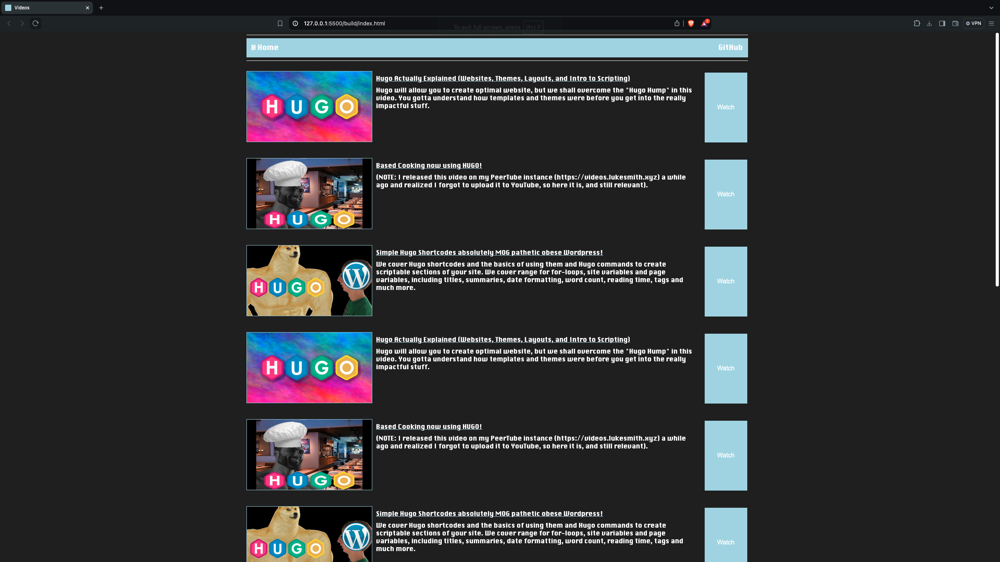
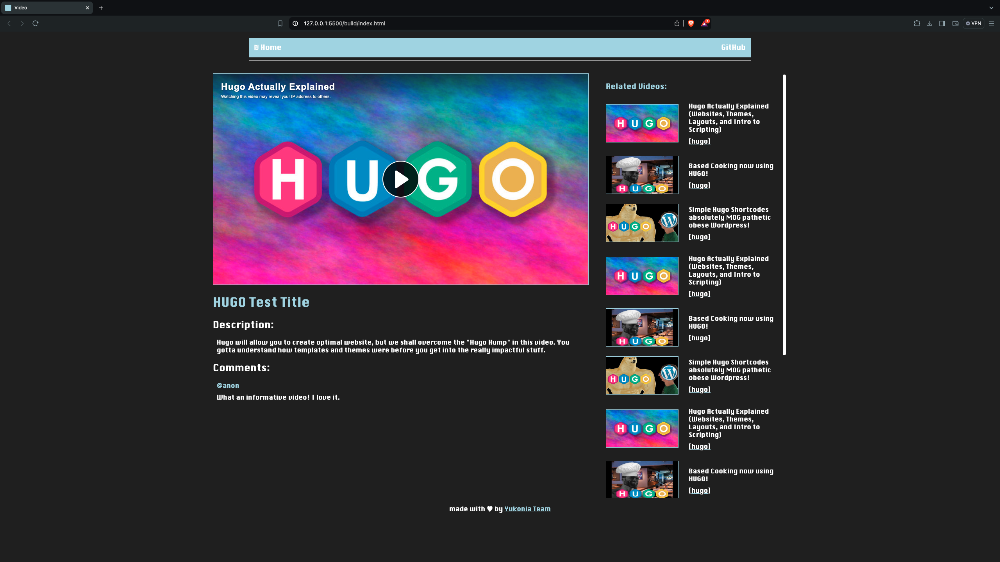

# Yukonia
Static video site generator

## Requirements:

- [Go 1.22](https://go/dev)

## Usage:

Firstly add your video information to videos.json and then change the css and template files in the "style" & "templates" folders to your liking.
You can then generate the HTML.

### Generate the HTML:

```bash
go run main.go
```

## Screenshots:

This is how the Homepage looks like:


This is how the Video page looks like:
